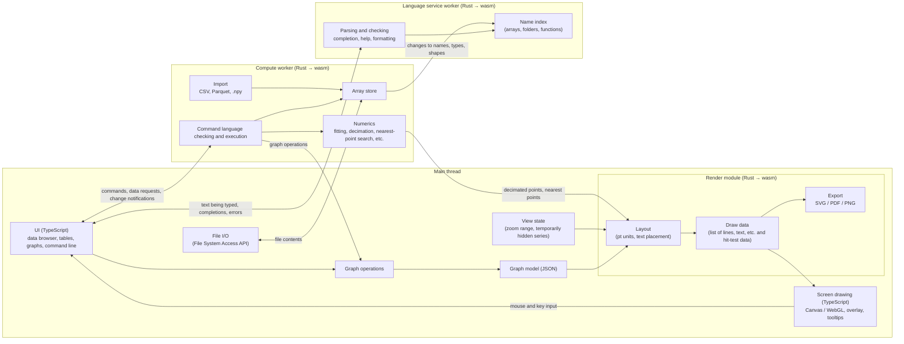

# figlab Specification (draft)

- Based on: draft.md (2026-10-09 version, after Decision 1 was changed)
- Related documents: language.md (formal definition of the command language)
- Status: Draft. Where a requirement is still `TBD` in the draft, this document makes a proposal, marked **[Proposal]**. Points that need the owner's confirmation are marked **[To confirm]**. Open questions are collected in Section 15.

## 1. Overview

figlab is a browser application (SPA) for making publication figures. Data is kept in folders that can be nested. Calculations and fits are done with a readable command language. Graphs have sizes in physical units and are exported as SVG, PDF, or PNG. There is no server. Everything runs in the browser.

### 1.1 Goals

figlab focuses on the following two use cases and aims to be easier to use for plotting than spreadsheet software (Excel, Google Sheets, etc.).

1. **Checking measurement data (Quick Plot).** Drop a CSV or similar file, plot it immediately, and check it while switching columns.
2. **Publication figures.** Refine the graph checked in Quick Plot as is, and export it as a figure ready for publication.

Data entry, data editing, and general-purpose calculation are left to spreadsheet software and are out of scope for figlab. The table view is limited to inspection and light edits.

Common problems when plotting in spreadsheet software, and how figlab addresses them:

| Common problem in spreadsheet software | figlab |
|---|---|
| In line charts, the x axis is treated as categories rather than numbers, and the spacing is wrong | Numeric columns are always drawn on numeric axes. A category axis is used only when a string column is given (8.3.1) |
| The x column has to be fixed every time | The first numeric column becomes x automatically. Other columns are switched with a click (1.2) |
| Setting color and marker for each series takes many clicks | Graphs are drawn from the start in a default style suited to publications. Templates change many settings at once (8.7) |
| Log axes, exponent notation, and super/subscripts in labels are tedious | Log axes are toggled with a single key. Labels are written as `\it{E}` or `x^{2}` (8.4) |
| Hard to make figure sizes consistent in mm | The plot area size is set in mm (8.1) |
| Row limits, and large data is slow | 10 million points are drawn with decimation (9.3) |
| Checking the value of a point is tedious | Hovering shows the original data value with units (12.3.2) |
| Overlaid series are hard to read, and hiding one temporarily is tedious | Click a legend entry to hide a series temporarily; double-click to show only that series (12.3.3) |
| Fitting is limited to a few trendline types | Gaussian, Lorentzian, Voigt, etc. with parameter errors. In Quick Plot, a fit needs only a selected range (6.5.1) |
| Nothing records what was done, so the same figure cannot be recreated | Every operation is recorded as a command in the history and can be re-run (6.6) |
| PDF exports look different depending on the environment | Exports are made from the same draw data as the screen, with fonts embedded (Section 9) |

### 1.2 From Quick Plot to a publication figure

1. **Drop a file and it is plotted.** Import settings are detected automatically (Section 10) and the data is plotted immediately, without a confirmation dialog. The preview opens only when the detection needs correcting.
2. **Choose different columns.** In the Quick Plot panel (12.2), selecting the x column and checking y columns re-plots the data.
3. **Inspect.** Drag to zoom and double-click to reset. Hover over a point to read its value. Click a legend entry to hide a series for a while. Press a key to switch an axis to log scale (12.3).
4. **Fit right away.** Select a range and a model to run a fit. The curve and the parameters (value ± error, with units) appear on the graph (Quick Fit, 6.5.1).
5. **Prepare the figure.** Apply a template to the same graph, set its size in mm, and export it. Fit curves are carried over. There is no need to start over.

- **Quick Plot works without creating a project.** It needs no folder access permission, so it also works in Safari and Firefox. When the user wants to keep the work, they save it as a project at that point (saving requires Chrome / Edge).
- Operations in Quick Plot are also recorded as commands, and they become part of the history when the work is saved as a project.
- **Steps 1–5 need no commands. They can all be done in the GUI.** Inside, each GUI operation runs as a command.

## 2. Design principles

The draft's "convenience over a rich feature set" is made concrete as follows.

- **Ready immediately.** The page is usable within 2 seconds of opening. No large runtime is loaded. Dropping a file plots it with no setup.
- **Readable at a glance.** Commands are written with English words and `key=value`, as in `plot fig1 norm vs energy style=markers`.
- **Most things can be done in the GUI.** Every GUI operation is recorded in the history as the matching command. Users who do not remember a command can learn it from the history.
- **Publication-ready defaults.** Good defaults matter more than more features. With no settings, a figure should already be ready for a paper (fonts, line widths, tick directions).
- **Strict and verifiable.** The command language is defined by an unambiguous grammar and has no implicit behavior. People and AI can check syntax, run commands, and compare results without a browser (6.7).

## 3. Premises and their consequences

| Decision (draft) | Content | Consequence in this document |
|---|---|---|
| 1. Language | A command language with its own syntax (computational core in Rust/wasm) | The command language (Section 6, language.md). The computational core (array storage, arithmetic, fitting, decimation, import) is written in Rust, compiled to WebAssembly, and runs in a Web Worker (Section 4) |
| 2. Evaluation timing | Compute once | No dependency tracking. The value at the time of assignment is stored |
| 3. Browsers | Saving limited to Chrome | Project folders are read and written directly with the File System Access API. Saving is supported in Chrome / Edge (Chromium-based). Quick Plot (1.2), which needs no project, also works in Safari / Firefox |
| 4. Storage format | Something like the Excel file format | The contents are JSON and data files in standard formats. A folder is used while working; a zip file is used to bundle everything into one file (Section 11) [To confirm] |
| 5. Data size | 10 million points per series, 10 GB per project | Not all data is kept in memory (it is loaded when used). Drawing uses decimation and Canvas/WebGL (Section 9) |
| 6. Output | SVG / PDF / PNG | Screen display and exports are made from the same drawing model (Section 9) |

About Decision 5: WebAssembly (32-bit) can use at most 4 GB of memory, and less in practice. A 10 GB project cannot be held in memory at once, so arrays are loaded when used and unloaded when not in use. 10 million float64 values take 80 MB per array, which is fine one array at a time.

## 4. Architecture



- **The compute worker is the single owner of the data** (in Rust memory). The UI requests only what it needs for display (the visible rows of a table, points decimated to the drawing resolution for a graph).
- **The graph model on the main thread (JSON) is the single owner of each graph.** GUI operations and commands both change a graph through the same "graph operations". A graph operation has a fixed kind and typed arguments. This gives three benefits:
  - GUI operations can be recorded in the history as matching commands
  - Undo/Redo can be built from inverse operations
  - Graphs can be edited while calculations run
- Operations that change data (import, calculation, table edits) are all executed as commands in the compute worker. When done from the GUI, the generated command is recorded in the history.
- **Drawing is split between the Rust render module and TypeScript** (9.1).
  - The Rust render module (wasm) decides what to draw and where: layout, text placement, building the draw data, and SVG/PDF/PNG export. The command-line tool `figlab run` uses the same module, so the browser and the command line produce the same figures
  - TypeScript draws the draw data on Canvas / WebGL. It also handles mouse and key input, the overlay (cursor, selection, highlights), and tooltips (12.3)
  - The render module runs on the main thread, not in the compute worker. Laying out a single graph is cheap, so the screen stays responsive while fits or imports are running
- **The computational core is a Rust library.** It is built for the browser (wasm) and for the command line (native). Both give bit-identical results (language.md 10.2).
- **The language service runs in its own worker, separate from the compute worker.** It uses the same Rust code as `figlab check`. It provides highlighting, completion, help, error reporting, and formatting (12.1). It does not hold array contents. It only gets an index from the compute worker: names, types, shapes, and whether coordinates are set. So completion keeps working during long fits or `for` loops.
- **Every statement finishes.** The only loop is `for` over a collection of known size, and there is no recursion. Fitting has an iteration limit.
- **A `for` loop can be stopped between iterations.** The compute worker runs `for` one iteration at a time. Between iterations, it checks for stop requests. A single statement is never stopped halfway. If the compute worker stops responding, a new worker is started. The state is then restored from the last save (from v1, from the crash-recovery snapshot).

### 4.1 Technology [Proposal]

| Part | Candidates |
|---|---|
| UI and screen drawing | TypeScript, Vite. UI framework not decided. Screen drawing uses Canvas 2D and WebGL |
| Render module | Rust (wasm). Runs on the main thread in the browser, natively on the command line |
| Computational core | Rust. wasm-bindgen for the browser, a native build for the command line |
| Command language | Hand-written recursive-descent parser (one-to-one with the EBNF in language.md Section 3). The same parser is used for checking, execution, the language service, and the command-line tool |
| Command line and editor | CodeMirror 6 (lightweight and easy to extend with a custom language. Monaco, used by VS Code, is several MB and conflicts with the 2-second startup target) |
| Language service protocol | Follows LSP (Language Server Protocol). In the browser, it is used through worker messages. External editors use it through `figlab lsp` |
| Numerics | Math functions: the `libm` crate (so the browser and command-line versions give identical results). Fitting: Levenberg–Marquardt (the Rust `levenberg-marquardt` crate with bounds added, or the C implementation cmpfit compiled to wasm) |
| Text shaping | rustybuzz (a Rust port of HarfBuzz), ttf-parser |
| Export | PDF: krilla or pdf-writer (font subsetting with subsetter). SVG: written by figlab. PNG: tiny-skia. All are pure Rust and work both in wasm and natively |
| Import | CSV: the `csv` crate + `encoding_rs` (Shift_JIS support). Parquet: the `parquet` crate or a JavaScript reader |

## 5. Data model

### 5.1 Arrays

| Attribute | Description |
|---|---|
| Name / path | Of the form `root.sample1.intensity` (separated by `.`). Naming rules are in language.md 2.3 (case-sensitive, but names that differ only in case cannot exist in the same folder) |
| Type | float64 / float32 / integers (8–64 bit, signed and unsigned) / complex128 / date-time / string |
| Dimensions | 1–4. [Proposal] The data model supports up to 4 dimensions; the UI (tables, graphs) targets 1D/2D. Arrays with 3 or more dimensions are displayed as 2D slices |
| Coordinates per dimension | Start, step, unit. "Not set" is a separate state from "set" (language.md 4.3). Used for heatmap axis values and for the x values of 1D data that has no x array |
| Data unit | String |
| Dimension labels | Labels for each row/column (optional) |
| Note | Free text. The source file name and import settings are recorded automatically |

- Missing values are represented by floating-point NaN. Integer types have no missing values.
- NaN points are not drawn, and lines break there (an option connects across them instead).

### 5.2 Folders and variables

- Folders can be nested. There is a "current folder"; arrays and variables written by name alone are looked up there (changed with `cd`).
- Besides arrays, folders can hold numeric and string variables. Variables are saved in the project too.
- The results of a fit are also created as a folder (6.5).

## 6. Calculation (command language)

### 6.1 Principles

- **A custom syntax that is easy to write and read.** The main concepts are arrays, folders, and coordinates (Section 5).
- **Strict, unambiguous syntax.** The kind of statement is determined by its first word, and there is no implicit behavior.
- **The formal definition has exactly two sources: language.md and `spec/commands.json` (the table of commands and functions).** The parser, completion, help, and checking tools are all built from these two.

### 6.2 Examples

```
mkdir sample1
cd sample1
source raw                                        // register the source folder (a folder picker opens the first time)
load "scan01.csv" from=raw format=csv header=1    // create one array per column
array norm = intensity / max(intensity)           // define an array
array model = exp(-axis(200, start=0, step=0.05, unit="meV") / 2.5)
norm[0..9] = nan                                  // overwrite points 0 to 9 (both ends included)
let peak = max(intensity[x=1.0..2.0])             // maximum where the coordinate is 1.0 to 2.0
peak                                              // show the value
```

There are six kinds of statements, determined by the first word.

| Form | Meaning |
|---|---|
| `let k = expr` | Define a variable (replace it if it exists) |
| `array w = expr` | Define an array (replace it if it exists). Its shape and coordinates come from the result of the expression |
| `w = expr`, `w[0..9] = expr` | Overwrite values of an existing array. Its shape does not change |
| `command args key=value …` | Operations such as import, graphs, and fitting |
| `for var in collection do` … `end` | Repeat (6.2.1) |
| An expression alone | Show its value |

Function definitions (`fn`) are written in user function files (6.4).

#### 6.2.1 Loops

Use `for` to apply the same processing to several data sets. Only integer ranges, lists, lists of folders, and lists of arrays can be iterated (language.md 5.5).

```
load "scan*.csv" from=raw format=csv header=1 into=root.scans   // one folder per file
graph fig1 width=60mm height=45mm
for d in folders(root.scans) do
    array d.norm = d.intensity / max(d.intensity)
    fit d.norm vs d.energy model=gauss into=d.fit
    plot fig1 d.norm vs d.energy as=nameof(d)
end
```

### 6.3 Strictness

Details are in language.md Sections 1, 4, and 5.

- Names are created only by `let`, `array`, `fn`, and commands that create names. Assigning to a name that does not exist is an error.
- Expressions operate on whole arrays. Operations between arrays of different shapes, or with conflicting coordinates that are set, are errors (operations with scalars are allowed).
- No implicit type conversion. Out-of-range indices, unknown options, and repeated options are errors.
- Confusing expressions (mixing `and` and `or`, chained comparisons) cannot be written without parentheses.
- A long statement continues on lines indented deeper than its first line. The body of a `for` is indented by 4 spaces (language.md 2.1).
- The only loop is `for` over a collection of known size. There is no `while`.

### 6.4 User functions

`fn` defines a function consisting of a single expression. Functions are written in `.figf` files in the project's `procedures/` folder and edited in the built-in editor. They can be used as soon as the file is saved.

```
fn linbg(x | a, b) = a + b*x
fn gauss2(x | a1, c1, w1, a2, c2, w2) =
    a1*exp(-((x - c1)/w1)^2) + a2*exp(-((x - c2)/w2)^2)
```

- Inputs come before `|` and parameters after it. Because parameters are declared, a typo is reported as an undefined name.
- Functions are pure: they cannot refer to arrays or variables in folders. Recursion is not allowed.

### 6.5 Curve fitting

```
fit intensity vs energy model=gauss into=fit1
fit intensity vs energy model=gauss2
    init=(a1=1, c1=0.5, w1=0.1, a2=0.5, c2=1.2, w2=0.1)
    fix=[c1] range=0.5..3.0 into=fit2
fit decay vs time model=expdecay sigma=err bounds=(tau=0..inf) into=fit3
plot fig1 fit2.curve vs energy style=line color=red
let pos = fit2.c1
```

| Option | Description |
|---|---|
| `model` | A built-in model, or an `fn` with `\|` |
| `vs` | The independent-variable array (if left out, the coordinates of y are used) |
| `init` | Initial parameter values. Optional for built-in models, which estimate them from the data |
| `fix` | Parameters to hold fixed |
| `bounds` | Parameter bounds, written as ranges (`tau=0..inf`) |
| `range`, `points` | The part of the data used for the fit (a coordinate range, or a range of point indices). In the GUI, set from cursors or a selection on the graph |
| `sigma` | An array of per-point standard deviations (used as weights) |
| `maxiter` | Maximum number of iterations |
| `into` | The folder that receives the results (required) |

Built-in models (formulas are written in command-language syntax; `help <model>` shows the formula, parameter descriptions, and derived quantities, 6.8):

| Model | Formula | Parameters |
|---|---|---|
| `line(x \| a, b)` | `a + b*x` | a: intercept, b: slope |
| `poly2`–`poly9` (e.g. `poly3(x \| c0, c1, c2, c3)`) | `c0 + c1*x + c2*x^2 + c3*x^3` | ck: coefficient of degree k |
| `gauss(x \| y0, a, x0, w)` | `y0 + a*exp(-((x - x0)/w)^2)` | y0: baseline, a: height, x0: center, w: width (√2 times the standard deviation σ; FWHM is `2*sqrt(ln(2))*w`, about 1.665w) |
| `lor(x \| y0, a, x0, w)` | `y0 + a/(1 + ((x - x0)/w)^2)` | y0, a, x0 as in gauss. w: half width at half maximum |
| `voigt(x \| y0, a, x0, wg, wl)` | `y0 + a*voigtpeak(x - x0, wg, wl)` | wg: width of the Gaussian component (same definition as w in gauss), wl: half width at half maximum of the Lorentzian component. `voigtpeak` is the Voigt function normalized to 1 at its center; it equals gauss as wl→0 and lor as wg→0 |
| `expdecay(x \| y0, a, tau)` | `y0 + a*exp(-x/tau)` | tau: time constant |
| `dblexp(x \| y0, a1, tau1, a2, tau2)` | `y0 + a1*exp(-x/tau1) + a2*exp(-x/tau2)` | Amplitudes and time constants of the two components |
| `power(x \| y0, a, p)` | `y0 + a*x^p` | p: exponent |
| `sine(x \| y0, a, f, phi)` | `y0 + a*sin(2*pi*f*x + phi)` | f: frequency (in units of 1/x), phi: phase (rad) |
| `sigmoid(x \| y0, a, x0, w)` | `y0 + a/(1 + exp(-(x - x0)/w))` | x0: midpoint of the transition, w: width of the transition |
| `lognormal(x \| y0, a, x0, w)` | `y0 + a*exp(-(ln(x/x0)/w)^2)` | x0: center, w: width in log space. Only for x > 0 |

The folder given by `into` receives:

| Name | Content |
|---|---|
| `fit2.c1`, etc. | Parameter values (one variable per parameter) |
| `fit2.err.c1`, etc. | Parameter errors |
| `fit2.covar` | Covariance matrix (dimension labels are the parameter names) |
| `fit2.curve` | The model curve, with the same number of points as y |
| `fit2.resid` | Residuals (NaN outside the fit range) |
| `fit2.chisq`, `fit2.chisq_red`, `fit2.npts`, `fit2.iterations`, `fit2.converged` | χ², χ² divided by the degrees of freedom, number of points used, number of iterations, whether the fit converged |

- A summary of the results (parameters ± errors, χ², etc.) is also written to the history.
- The fit dialog lets the user do the following; running it records the command in the history.
  - Choose the model, data, range, and weights
  - Edit initial values, fixed parameters, and bounds in a table
  - Overlay the model curve at the initial values on the graph to check it
- Numerical correctness is checked against the certified values of the NIST Statistical Reference Datasets (StRD) for nonlinear regression.
- Out of scope: global fits that share parameters across data sets, and confidence bands of the fitted curve, are left for future consideration.

#### 6.5.1 Quick Fit

A feature for fitting quickly on the graph during Quick Plot and checking the parameters. It uses the same computation as the `fit` command.

Operation:

1. **Select a range.** Hold the `F` key and drag on the graph to select the range used for the fit. If no range is selected, the whole visible range is used.
2. **Choose a model.** Choose from a small menu of built-in models (gauss, lor, voigt, line, expdecay, etc.). The model used last is listed first.
3. **See the result at once.** Initial values are estimated automatically and the fit runs. The curve is drawn on the graph, and the parameters are shown next to it.
4. **Move the range to refit.** Dragging an edge of the range updates the result.
5. When there are several series, the series to fit is chosen in the Quick Fit section of the Quick Plot panel (12.2). By default it is the first visible series.

Parameter display:

```
gauss   range x = 1.20 … 2.80 meV (412 points)
  y0    = 102.3 ± 1.8       counts
  a     = 5310 ± 40         counts
  x0    = 1.9842 ± 0.0011   meV
  w     = 0.1503 ± 0.0016   meV
  ──────────────
  fwhm  = 0.2503 ± 0.0027   meV
  area  = 1414 ± 18         counts·meV
  χ²_red = 1.08   converged (12 iterations)   [Copy]  [Edit initial values]
```

- **Units**: determined from the column units (the unit row detected at import, 10.1) and the model's definition ("same unit as x", "same unit as y"). Not shown for columns whose unit is unknown.
- **Digits**: values are rounded to match the error given to 2 significant digits.
- **Derived quantities**: quantities from the model's help (6.8), such as FWHM and area, are shown. Their errors are computed from the covariance matrix and the gradient (numerical derivative) of the quantity's formula.
- **Copy**: copies as tab-separated text that can be pasted into a spreadsheet (name, value, error, unit), or in the form `x0 = 1.9842(11) meV`.
- **Weights**: if an error column for y was imported, the user can choose whether to use it as weights. Otherwise the fit is unweighted.
- **When the fit does not converge**: a warning is shown, and initial values can be edited in the parameter table to retry (Edit initial values). The curve at the initial values can also be overlaid to check them.
- **History**: Quick Fit is also recorded as a `fit … into=fit1` command. When saved as a project, the results (`fit1.x0`, etc.) are kept. When the range is dragged and the fit rerun many times, only the last result is recorded.
- **Scope**: the MVP only fits a single built-in model. Fitting several peaks at once (choosing the number of peaks, a linear background, etc.) is left for the future. Good initial values are hard to estimate automatically for these fits.

### 6.6 History

- The history records, in time order, every command that runs. It also records the matching command for every GUI operation. The history is saved in the project in the canonical format (language.md 10.3).
- A line in the history can be selected and re-run.

### 6.7 Verification by AI

Details are in language.md Section 10.

- The computational core is also built as the native command-line tool `figlab`. Without a browser, it can:
  - check syntax, names, and types (`figlab check`)
  - run commands (`figlab run`)
  - format files in the canonical format (`figlab fmt`)
  - run the conformance tests (`figlab test`)
- The definitions of commands and functions are published in machine-readable form as `commands.json`. AI can read it to write commands and verify them with `figlab check`.
- Errors are reported in a fixed format: `<file>:<line>:<column>: <code>: <message>`.

### 6.8 Help

Descriptions of commands, built-in functions, fit models, and user functions can be viewed with the same content everywhere.

- Running `help <name>` on the command line shows it in the help panel (e.g. `help gauss`, `help fit`). `help` alone shows a list.
- The same content is shown while choosing a completion candidate and when choosing a model in the fit dialog.
- The command-line tool shows it with `figlab help <name>` (with `--json` for machine-readable output).

The help for a fit model shows:

- The formula (in command-language syntax and as typeset math)
- The meaning, unit ("same unit as x", etc.), and constraints (`w > 0`, etc.) of each parameter
- How initial values are estimated automatically
- Derived quantities (e.g. for gauss, FWHM `2*sqrt(ln(2))*w` and area `a*w*sqrt(pi)`)

All of this is kept in `commands.json`. The formulas of built-in models are written in command-language syntax. The conformance tests check them against the implementation. So the formula in the help always matches the actual computation.

For user functions, the `///` comments written just before the function become its help (language.md Section 6).

```
/// Sum of two Gaussian peaks
/// a1: height of the first peak
/// c1: center of the first peak
/// w1: width of the first peak
fn gauss2(x | a1, c1, w1, a2, c2, w2) =
    a1*exp(-((x - c1)/w1)^2) + a2*exp(-((x - c2)/w2)^2)
```

## 7. Tables

- Several arrays are shown side by side as columns. 2D arrays are expanded into several columns. Coordinates can also be shown as a column.
- The table uses virtual scrolling (only the visible rows are fetched from the compute worker), so scrolling stays smooth even with 10 million rows.
- Editing a cell runs the matching assignment command (`w[12] = 3.4`) and records it in the history.
- Copy and paste with spreadsheet software works (tab-separated text). Pasting into an empty column creates a new array and records the matching command in the history.

## 8. Graphs

### 8.1 Graph model and commands

A graph is represented as JSON, and this JSON is also the storage format.

```json
{
  "id": "fig1",
  "size": { "plotWidth": "60mm", "plotHeight": "45mm", "margins": "auto" },
  "font": { "family": "Arimo", "size": "9pt" },
  "axes": {
    "left":   { "position": "left",   "scale": "linear", "range": "auto",     "label": "Intensity (arb. units)" },
    "bottom": { "position": "bottom", "scale": "log",    "range": [0.1, 100], "label": "\\it{E} (meV)" }
  },
  "traces": [
    {
      "id": "norm", "type": "xy", "y": "root.sample1.norm", "x": "root.sample1.energy",
      "xAxis": "bottom", "yAxis": "left",
      "style": { "mode": "markers", "marker": "circle", "size": "3pt", "color": "#000000" },
      "overrides": [ { "index": [10, 10], "style": { "color": "#d62728" } } ]
    }
  ],
  "legend": { "position": "top_right" },
  "annotations": []
}
```

- Sizes are given in physical units (mm / pt / in / cm). The size is set for the **plot area**, not for the whole figure. This keeps axis lengths the same across figures.
- Graph commands always name the target graph (an implicit "front graph" is never used).

```
graph fig1 width=60mm height=45mm font="Arimo" fontsize=9pt
plot fig1 norm vs energy style=markers marker=circle size=3pt
plot fig1 model style=line color=gray dash=dashed
style fig1 norm[10] color=red                  // change the color of point 10 only
style fig1 norm[20..29] marker=square          // change the marker of points 20 to 29
axis fig1 bottom scale=log range=0.1..100 label="\it{E} (meV)"
axis fig1 left range=auto label="Intensity (arb. units)" tickdir=in
legend fig1 position=top_right frame=false
export fig1 "fig1.pdf"                         // the format is determined by the extension
```

### 8.2 Traces (series)

| Type | Command | Description | Phase [Proposal] |
|---|---|---|---|
| xy | `plot` | Lines, markers, lines + markers, sticks, steps, bars | MVP |
| Bars per category | `plot … style=bars` | Bar chart where x is a string column or an array with dimension labels (8.3.1) | MVP |
| Histogram | `plot` | Draws an array made with `array h = histogram(w, bins=50)` as bars or steps | MVP |
| image | `image` | Heatmap of a 2D array. Color map and color range (linear / log) can be set | MVP |
| Color bar | `colorbar` | Shows the color mapping of an image or of value-dependent colors | MVP |
| Error bars | option of `plot` | ± given as separate arrays, a constant, or a percentage | v1 |
| Fill | option of `plot` | To zero, or to another trace | v1 |
| Contours | | Contours of a 2D array | Future |
| Waterfall | | Draws each row of a 2D array with an offset | Future |
| Box plot | | Distribution of values per category (drawn on a category axis) | Future |

Per-trace settings:

- Style: line color, width, and type (solid, dashed, etc.); marker shape, size, fill, edge color and width; opacity
- Style overrides for single points (`style fig1 norm[10] …`). This covers the draft's "change only specific markers within the same series"
- [Proposal] v1: value-dependent color and size. The values of another array are mapped to a color map or to sizes
- [Proposal] v1: offset and scale factor (e.g. stacked spectra)
- The name shown in the legend, and whether it appears in the legend
- Whether the trace is drawn (`style fig1 norm visible=false` keeps it in the graph without drawing it). This is a graph setting, separate from the temporary toggle by clicking the legend (12.3.3)
- Whether the trace is rasterized on export (9.3)

### 8.3 Axes

- Position: left, right, bottom, top. [Proposal] v1: extra axes at any position. The length of an axis can be set as a fraction of the plot area. This allows stacked panels in one graph
- Scale: linear, log, category (MVP; category in 8.3.1), time (v1)
- Range: automatic, manual, reversed
- Ticks: automatic major and minor ticks, manual ticks (values and labels given as arrays), direction (in, out, both), length, width, mirroring on the opposite side
- Tick labels: number of digits, exponent notation (`10^3` / `1e3` / a common `×10^3` moved into the axis label)
- Grid lines, zero line

#### 8.3.1 Category axes

An axis for drawing values per string category (e.g. counts per category).

```
array n = count(sample)                      // counts per category; category names go into the dimension labels
plot fig1 n style=bars                       // an array with dimension labels, so x becomes a category axis
plot fig1 yield vs material style=bars       // material is a string array
axis fig1 bottom order=["Fe", "Co", "Ni"] ticklabel_angle=45
```

- **When an axis becomes a category axis**: only in two cases. One is when a string array is given as x (or y). The other is when an array with dimension labels is plotted without `vs`. Numeric columns are always drawn on numeric axes. They are never treated as categories without notice.
- **Order** (`order`): order of appearance in the data (default), by name (`order=name`), by value, descending (`order=value`), or explicit with `order=[…]`.
- **Labels**: long labels can be rotated (`ticklabel_angle`) and wrapped.
- **Several series**: several series on the same category axis are drawn as grouped bars, or stacked (`barmode=group|stack`).
- **Aggregation functions**: `count(string array)` returns the count per category as an array with dimension labels (MVP). Per-category mean and standard deviation (e.g. `groupmean(values, categories)`, `groupstd(values, categories)`) are added in v1 so that mean ± standard deviation bar charts can be drawn.
- **Not allowed**: log scale, fitting, and coordinate ranges on a category axis are errors.
- Histograms of numeric data (`histogram(w, bins=50)`) are drawn on numeric axes as before.

### 8.4 Text formatting

Text in labels, legends, and annotations is written in a simple LaTeX-like notation. figlab converts it into glyph runs itself, so text stays text in exported SVG/PDF and can be edited in Illustrator.

| Notation | Meaning |
|---|---|
| `x^{2}` / `S_{n}` | Superscript / subscript (`^` and `_` must always be followed by `{…}`) |
| `\alpha`, `\Delta`, `\AA` | Greek letters and symbols (e.g. Å). Unicode characters can also be written directly |
| `\it{…}` / `\bf{…}` | Italic / bold |
| `\size{12}{…}` | Changes the font size of that part only (pt) |
| `\font{Times}{…}` | Changes the font of that part only |
| `\trace{norm}` | Draws the symbol of a trace in a legend |
| `\\`, `\{`, `\}`, `\^`, `\_` | The literal characters |

- Inside command strings, `\` has no special meaning, so it can be written as is (`label="\it{E} (meV)"`).
- Unknown `\` commands and `^` / `_` without `{…}` are errors.
- [Proposal] Future: full math typesetting (rendered with MathJax and exported as paths).

### 8.5 Legends and annotations

- Legend: generated from the traces; its text can be edited freely. Its position is given by a word such as `top_right` or as a fraction of the plot area.
- [Proposal] v1: annotations
  - Text boxes
  - Tags (labels attached to a point of a trace that move with the data; can have an arrow)
  - Lines, arrows, rectangles, ellipses
  - Positions can be given in data coordinates, as fractions of the plot area, or in physical units

### 8.6 Pages (multi-panel figures) and insets

[Proposal] v1

- Page: several graphs placed in physical units, with labels such as (a), (b), (c).
- Inset: a graph placed inside another graph.

### 8.7 Style templates

[Proposal] MVP (moved up from v1 because it is central to preparing a figure, 1.2). A JSON file that bundles settings such as axis line width, fonts, tick direction, and marker size is applied to a graph. It is applied as a set of graph operations, so it can be undone and is recorded in the history. Templates are stored in the project and can be exported as files for use in other projects.

## 9. Rendering and export

### 9.1 Pipeline

Graph model → layout (in pt) → draw data (a list of lines, markers, text, and images) → each output. Everything up to this point, including export, is done by the Rust render module; only drawing on the screen is done by TypeScript (Section 4).

- Screen display and SVG/PDF/PNG export are produced from the same draw data, so exports look exactly as on screen.
- Text on screen is drawn from the glyph positions and outlines made by the render module. The browser's own text rendering is not used. So text on screen sits exactly where it does in exported figures.
- The draw data also contains hit-test information (where each element is on screen), used for tooltips and for selecting elements (12.3).
- Point coordinates are read by TypeScript directly from arrays in wasm memory, without copying.
- The draw data format is versioned and documented as the contract between Rust and TypeScript.

The screen has three layers:

| Layer | Content | Redrawn |
|---|---|---|
| Graph layer | Axes, series, and text drawn from the draw data. The result is kept as an image | Only when the figure changes |
| Overlay layer | Cursor, crosshair, selection, highlighted points | Every frame (cheap) |
| HTML layer | Tooltips, input boxes for editing labels in place | When needed |

### 9.2 Fonts

- Measuring text exactly and embedding fonts in PDF requires the font files themselves. Browsers normally cannot read the files of fonts installed in the OS, so fonts are handled in two ways:
  - [Proposal] Bundle freely redistributable fonts with the app, such as Arimo (metric-compatible with Arial/Helvetica, from the Liberation Sans family) and Tinos (metric-compatible with Times). Both use the Apache License 2.0, and their license files are shipped with them
  - The user loads font files they have. [To confirm] Also consider using installed fonts through Chrome's Local Font Access API
- Only the glyphs used are embedded in PDF (subsetting).
- The same font files are used for the screen, SVG, PDF, and PNG. Text on screen is also drawn from the glyphs produced by the render module, not by loading the font into the browser (9.1).

### 9.3 Large data

| Output | Method |
|---|---|
| Screen (lines) | Decimated to the minimum and maximum per pixel column (computed in the compute worker). The result looks the same as without decimation |
| Screen (markers) | Traces with more than 100,000 points are drawn with WebGL. Points are sent to the GPU once, in data coordinates. Zoom, pan, and log transforms happen on the GPU, so the data is not sent again on every zoom |
| SVG/PDF (lines) | The same decimation at the export resolution (e.g. the same as 1200 dpi) keeps file sizes small |
| SVG/PDF (markers) | A trace with many points can be embedded as a raster image on its own (`plot … raster=true`). A warning is shown on export above a certain number of points |

### 9.4 Formats

- SVG: text is written as `<text>`. An option converts text to paths.
- PDF: fonts are embedded and text stays text. Colors are RGB only (no CMYK).
- PNG: drawn by the render module (tiny-skia) at the chosen resolution (dpi). Canvas is not used, so the browser and the command line produce the same image. An option makes the background transparent.
- Exports are produced from the graph settings (the graph model) only; the view state (12.3.1) is not used. When the view state differs from the settings, see 12.3.4.

## 10. Import

| Format | Description | Phase [Proposal] |
|---|---|---|
| CSV / TSV / text | Delimiter, header row (column names), comment prefix, lines to skip, encoding (UTF-8 / Shift_JIS, etc.), missing-value markers, and column names can be set. Anything not set is detected automatically (10.1) | MVP |
| Text with several data blocks | Several tables separated by blank lines or heading lines are imported into one folder per block | v1 |
| Paste from spreadsheet software | Imported as tab-separated text | MVP |
| .npy | The NumPy format. Since it is also the storage format, data made with other tools can be imported as is | MVP |
| Parquet | One array per column | v1 |
| HDF5 / NeXus | Read with h5wasm (HDF5 compiled to wasm) | Future |

```
source raw
load "scan01.csv" from=raw format=csv header=1 sep="," comment="#" encoding=shift_jis
    names=[energy, intensity, err] into=sample1
```

- Source folders are registered with a name by `source` and referred to with `from=<name>`. Access to registered folders is stored in the browser, so commands in the history can be re-run as they are.
- A wildcard in the file name (`"scan*.csv"`) imports each matching file into its own folder, named after the file (without extension), under the `into` folder. Combined with `for d in folders(…)`, the same processing can be repeated.
- If an array with the same name already exists, it is an error. Add `replace=true` to replace it.
- Dropping a file imports it with the detected settings and plots it immediately (1.2). To correct the settings, open the import panel with a preview. The chosen settings are recorded in the history as the matching command.
- The note of each imported array records the source file name, its modification time, and the import settings. [To confirm] The source file itself is not copied into the project.

### 10.1 Automatic detection

Whether a dropped file is read correctly with no further input determines how usable Quick Plot is. The following are detected automatically:

| Detected | Method |
|---|---|
| Encoding | Check whether the file is valid UTF-8; if not, try Shift_JIS and others. A leading BOM is also checked |
| Delimiter | Of comma, tab, semicolon, and whitespace, the one that gives the most consistent column count per line |
| Leading metadata lines | Find the line where the table with a consistent column count starts; earlier lines are skipped and recorded in the note |
| Header row and unit row | If the first 1–2 lines of the table cannot be read as numbers, they are treated as column names and units (e.g. `Energy`, `meV`) |
| Comment lines | Lines starting with `#`, `%`, or `;` |
| Column types | Number, date-time, or string. The decimal separator (`.` / `,`) is also detected |
| Missing values | Empty fields, `NaN`, `NA`, `-`, etc. |

- The result of detection is shown on one line in the Quick Plot panel (e.g. `UTF-8 · comma-separated · 12 metadata lines skipped · header row · unit row`).
- Detection is tested with files actually produced by measurement instruments.
- The compute worker reads large files in parts. Plotting starts before reading finishes.

## 11. Project storage format

### 11.1 Layout

The same idea as Excel files (.xlsx), which are zip files of XML and other files. Everything inside is in formats that other tools and AI can read directly.

```
myproject.figlab/
├── manifest.json        format version, app version, created/modified times
├── data/                mirrors the folder hierarchy (data/ corresponds to root)
│   └── sample1/
│       ├── _folder.json   variables in the folder, ordering
│       ├── energy.npy     numeric data (NumPy format)
│       ├── energy.json    coordinates, units, dimension labels, note
│       ├── labels.json    string arrays are stored as JSON arrays
│       └── ...
├── graphs/fig1.json     graph model (8.1)
├── pages/page1.json     pages (8.6)
├── styles/paper.json    style templates (8.7)
├── sources.json         names of folders registered with source
├── procedures/*.figf    user functions (6.4)
└── history.figc         command history (appended in the canonical format)
```

- Numeric data is stored as `.npy` (the standard NumPy format). It has its type and shape as text at the start and can be read by many tools. Unlike CSV, values lose no precision, and size stays reasonable even at the 10 GB scale.
- Graphs and metadata are JSON. User functions and the history are plain text. So diffs can be viewed with jj/git.
- The history `history.figc` is a command file that can be re-run as is with `figlab run`.

### 11.2 Folder and zip [To confirm]

This document reads the draft's Decision 4 ("something like the Excel file format") as follows:

- **While working, the project is a folder.** Saving rewrites only the files that changed, so saving finishes quickly even for a 10 GB project.
- **To bundle the project into a single file, the same contents are exported as an uncompressed zip, `.figz`** (for sharing and archiving). Opening a `.figz` extracts it into a folder to work on.

Always working on a single zip file would mean rewriting the whole file on every save for a 10 GB project, which is impractical.

### 11.3 Saving

- Saving is explicit (⌘S). Only changed arrays and graphs are written.
- [Proposal] v1: unsaved changes are kept temporarily in browser storage (OPFS) for crash recovery.
- The format version is stored in `manifest.json`, and projects in older versions are converted automatically when opened.

## 12. User interface

The user works with several windows side by side, implemented as dockable panels within a single browser page.

- Quick Plot panel (12.2)
- Data browser: a tree of folders and arrays. Arrays can be dragged into graphs and tables
- Command line and history (12.1)
- Tables (several can be open)
- Graphs and pages (several can be open)
- Property panel: settings of the selected element (trace, axis, text, etc.). Also opened by double-clicking an element on a graph
- Fit dialog (6.5)
- Editor: edits user functions (`.figf`) and scripts (`.figc`) (12.1)
- Help panel (6.8)

Operations on graphs are described in 12.3.

### 12.1 Command line and editor

The command line and the editor use the same editor component (CodeMirror 6) and the same language service. They share these features:

| Feature | Description | Phase [Proposal] |
|---|---|---|
| Highlighting | Colors keywords, command names, option names, numbers, lengths (`60mm`), colors, strings, and comments. The keyword lists are generated from `commands.json` | MVP |
| Completion | Offers candidates depending on the position (table below) | MVP |
| Hover help | Hovering a name shows the same content as `help` (6.8) in a small popup. For fit models: the formula and the meaning and unit of each parameter | MVP |
| Diagnostics | Underlines problems while typing, with the same error codes and messages as `figlab check`. Syntax errors are detected immediately; name and type errors are detected against the contents of the project | MVP |
| Signature help | Typing `(` after a function shows its arguments and highlights the current one | v1 |
| Formatting | Formats to the same canonical format as `figlab fmt`, on save or by shortcut | v1 |
| Go to definition / rename | Jumps to the definition of a user function. Renames arrays and functions across the project | v1 |

Completion candidates:

| Position | Candidates |
|---|---|
| Start of a statement | Command names, `let` / `array` / `for` |
| After a command | Options of that command (excluding those already used) |
| After `style=` and similar | Allowed values (`markers`, `line`, etc.) |
| Where an array is expected | Arrays in the current folder. After `root.` or `d.` (a loop variable), the contents of that folder |
| After `model=` | Built-in models and user functions with `\|` |
| Inside `init=(` or `fix=[` | Parameter names of the model |
| Where a function is expected | Built-in functions and user functions (with their signatures) |
| Where a length is expected | Units (`mm`, `pt`, etc.) |

Command-line specific behavior:

- Enter runs the statement. If the statement is incomplete (inside a `for`, unclosed parentheses), it is not run; a new line is started with automatic indentation. Shift+Enter always inserts a new line.
- ↑↓ move through the history, which can also be searched.
- GUI operations are also shown in the history as matching commands.
- A button stops a running `for`.

Editor-specific behavior:

- User functions (`.figf`) and scripts (`.figc`) can be opened in tabs.
- A script can be run for the selected range only, or as a whole file.
- Saving a user function file checks its syntax; if there are no problems, the functions can be used immediately.

### 12.2 Quick Plot panel

Opens when a file is dropped and gathers the Quick Plot operations (1.2).

- Shows the result of import detection on one line. The **Edit import settings** button opens the import panel with a preview.
- In the list of columns, select one column as x and check the columns to plot as y.
  - [Proposal] Initially, the first numeric (or date-time) column is x. If there are 6 or fewer remaining numeric columns, all are overlaid; with 7 or more, only the first is plotted
  - Selecting a string column as x gives a bar chart on a category axis (8.3.1)
- Shows the minimum, maximum, number of points, and number of NaN values of each column.
- The Quick Fit section (6.5.1) shows the series to fit, the model selection, and the parameter table.
- The **Prepare figure** button names the graph, applies a template (8.7) and size, and turns it into a regular graph.

### 12.3 Operations on graphs

| Operation | How |
|---|---|
| Zoom | Drag to select a range. The wheel (pinch on a trackpad) zooms in and out around the mouse position |
| Pan | Drag while holding Space |
| Reset | Double-click to return to the range in the graph settings |
| Toggle log scale | `L` key on the axis under the mouse |
| Read values | Hover over the data (12.3.2) |
| Show/hide series | Click the legend (12.3.3) |
| Quick Fit range | Drag while holding `F` (6.5.1) |
| Move legends and annotations | Drag. Recorded as a command on release |
| Edit labels | Double-click to edit in place |

- While zooming or panning, TypeScript scales and moves the current image, so the screen responds at once. Series drawn with WebGL are transformed on the GPU. When the movement stops, the render module recomputes the ticks. The compute worker decimates the points again. Then the exact figure replaces the temporary one.
- While zooming, tick labels update with a slight delay.

#### 12.3.1 View state

The zoom range and temporarily hidden series are kept as the "view state", separate from the graph settings (the graph model).

- The view state is not recorded in the history and is not subject to Undo. It is not saved in the project either (reopening shows the graph as defined by its settings).
- Export and `figlab run` use only the graph settings (9.4).
- To apply the view state to the figure, it is committed to the graph settings (12.3.4).

#### 12.3.2 Tooltips

When the cursor comes near a data point (within 8 px by default), a tooltip shows its value. The point is also highlighted in the overlay layer.

```
norm
x = 1.9840 meV
y = 5412 counts
point 238
```

| Series type | Content |
|---|---|
| xy | Series name, x, y (with units), point index. ± values if there are error bars |
| Bars on a category axis | Series name, category name, value |
| Heatmap | x, y, and z values (with units) |
| Fit curve | Model name, x, model value |

- **Shows original data values.** The screen shows decimated points. So the compute worker finds the original point nearest to the cursor. If x is in ascending order, it uses binary search. Otherwise it uses a spatial index.
- **Digits**: enough digits to tell the original values apart (up to 6 significant digits).
- **Two hover modes** (like plotly's hovermode), switched from the graph toolbar or with the `H` key:
  - Closest point (default): the single point nearest to the cursor
  - Unified by x: one tooltip lists all visible series at the cursor's x. For each series, it uses the point with the nearest x
- When the cursor is not near a point, the cursor position (x, y) is shown in a corner of the graph. A crosshair can be shown optionally.
- **Pinning**: clicking pins the tooltip in place (several can be pinned). `Esc` clears them. Pinned tooltips are part of the view state and are not part of the figure. In v1, a pinned tooltip can be converted into an annotation (a tag, 8.5) to keep it in the figure.
- **Copy**: pressing ⌘C while a tooltip is shown copies the values as tab-separated text.
- Hidden series (12.3.3) are excluded.

#### 12.3.3 Showing and hiding series

As in plotly, clicking the legend shows or hides series temporarily.

| Action | Result |
|---|---|
| Click a legend entry | Toggles that series. Hidden entries are shown dimmed in the legend |
| Double-click a legend entry | Shows only that series. Double-clicking again shows all series |

- When an axis range is automatic, it is recomputed from the visible series only (as in plotly).
- Temporary toggles are part of the view state (12.3.1), so they are not recorded in the history and are not used for export.
- To keep a series in the graph but never draw it, set `visible=false` in the graph settings (8.2).
- This is different from the y-column checkboxes in the Quick Plot panel (12.2). The checkboxes add series to or remove them from the graph and are recorded as commands.

#### 12.3.4 View state and export

When exporting while the view state differs from the graph settings (zoomed in, series temporarily hidden), a dialog asks how to export:

- **Export as shown**: commits the view state to the graph settings (runs `axis … range=…` and `style … visible=false` commands and records them in the history), then exports.
- **Export as defined**: ignores the view state and exports according to the graph settings.

Either way, the exported figure can be reproduced from the history and the graph settings alone, and matches the result of `figlab run`. Separately from export, the graph toolbar has a button that commits the view state (**Apply view to figure**).

## 13. Non-functional requirements

| Item | Requirement |
|---|---|
| Supported browsers | All features including saving: the latest desktop Chrome / Edge. Quick Plot (1.2) and export also work in the latest Safari / Firefox |
| Startup | Usable within 2 seconds of opening the page (from the second visit, with the cache in effect) |
| Offline | After the first visit, works without a network (Service Worker caches the whole app). Never sends data anywhere |
| Distribution | GitHub Pages. No special HTTP headers are required. The command-line tool `figlab` is distributed as binaries on GitHub Releases |
| Memory | Arrays held in memory during work are kept to about 2 GB in total; unchanged arrays not in use are unloaded first. Raising this limit with 64-bit wasm (memory64) may be considered in the future |
| Quick Plot speed | [Proposal] A 100,000-row CSV is plotted within 1 second of being dropped. A 100 MB CSV starts plotting while still being read, with the first drawing within 2 seconds. Re-plotting after switching columns within 0.2 seconds. Quick Fit gives results within 0.2 seconds for ranges of up to 100,000 points. While the range is being dragged, the fit runs again when the movement stops |
| Interaction | [Proposal] Zoom and pan respond at 60 frames per second. The exact figure replaces the temporary one within 50 ms after movement stops. Tooltips appear within 16 ms of cursor movement (except the first time for large series whose x is not ascending, when the index is built). Toggling series from the legend and redrawing after a style change within 50 ms |
| Performance targets | [Proposal] Redrawing a 10-million-point trace within 0.2 seconds (once decimated), re-decimation on zoom within 0.5 seconds, arithmetic between two 10-million-point arrays in about 0.1 seconds, smooth table scrolling. The time to import a 10-million-row CSV is set after measurement |
| Reproducibility | The same project and the same commands give bit-identical results in the browser and on the command line |
| Undo/Redo | [Proposal] Operations on graphs, pages, and styles can be undone without limit. Data changes can be undone only when the array before the change is below a certain size (e.g. 100 MB) |
| UI language | English only. Menus, buttons, dialogs, error messages, warnings, help, completion descriptions, and the output of the `figlab` command are all in English. There is no localization mechanism (no translation files). User-written content (labels, `///` comments, strings other than names) may be in Japanese or any other language |
| License | MIT OR Apache-2.0. Users may choose either. Dependencies and bundled fonts must use licenses that are compatible with both (MIT, Apache-2.0, BSD, ISC, Zlib, Unicode, OFL for fonts, and similar). GPL and other copyleft licenses are not allowed. This is checked in CI (development.md 5.2) |

## 14. Phases [Proposal]

The draft's requirements have no priorities yet, so this document proposes them.

### MVP

- **Quick Plot**: plot on drop with automatic detection; the Quick Plot panel; zoom, pan, and log toggle; tooltips; showing and hiding series from the legend; Quick Fit (built-in models, automatic initial values, range selection, parameter display and copy); Quick Plot in Safari and Firefox
- **Publication figures**: publication-ready default style; style templates; physical sizes; text formatting; legends; SVG/PDF/PNG export
- **Data**: folders and arrays (1D/2D, coordinates); CSV/TSV/text/.npy import; tables (viewing, light edits, paste); saving and resuming in folder format
- **Plots**: xy traces (lines, markers, per-point overrides); histograms; bar charts on category axes and `count`; heatmaps and color bars; left, right, bottom, and top axes (linear, log, category)
- **Command language**: definitions, assignments, commands, built-in functions, user functions; the command line and history; the editor and language service (highlighting, completion, hover help, diagnostics); `figlab check`, `figlab fmt`, `figlab run`

### v1

- `for` (its grammar is fixed in the MVP)
- More language service features (signature help, formatting, go to definition, rename) and `figlab lsp`
- All features of the `fit` command (user-function models, fixed parameters, bounds, weights, the fit dialog; 6.5)
- Error bars, fills, value-dependent color and size, offsets and scale factors
- Extra axes, time axes
- Annotations (including turning pinned tooltips into annotations), pages (multi-panel figures), insets
- Per-category aggregation (`groupmean`, etc.)
- Import of text with several data blocks, Parquet, `.figz`
- More Undo support, crash recovery

### Future

- Contours, waterfalls, box plots, math typesetting
- HDF5/NeXus import, display of 3D and higher arrays
- Global fits, confidence bands, Quick Fit with several peaks and linear backgrounds

- MVP completion is judged against the draft's acceptance figures (not yet chosen) and the Quick Plot speed targets (Section 13).
- In the MVP, everything from Quick Plot to export can be done in the GUI alone, without writing commands (1.2).
- For the command language, language.md, `commands.json`, and the conformance tests are fixed at the very start of the MVP, before implementation.

## 15. Open questions

| # | Question | Current answer |
|---|---|---|
| 1 | Storage format: is this reading right? "Work in a folder. To make one file, export a zip." | As in 11.2 |
| 2 | Does "10 GB per project" mean the total on disk? What is the upper limit on data drawn at once in one graph? | Total on disk. Up to 2 GB in memory at once |
| 3 | Was "3D surface plots" removed from the non-goals because they are planned? | Not included in the phases either |
| 4 | Open questions about the command language (language.md Section 11) | As in language.md |
| 5 | Should source files be copied into the project (Section 10)? | No |
| 6 | Which fonts can be used (9.2)? | Bundled fonts + fonts loaded by the user |
| 7 | Acceptance figures and priorities of each requirement (draft) | The proposal in Section 14 |
